# LPT 项目

<div align="center">
<h1>LPT 项目集合</h1>
</div>

<div align="center">
一个包含多个企业级项目的集合，涵盖微服务架构、单体应用、前端项目等多种技术栈
</div>

## 📚 项目介绍

本项目集合包含多个独立项目，每个项目都针对不同的业务场景和技术需求。从微服务架构到单体应用，从前端项目到后端服务，提供了完整的企业级解决方案。

## 📋 项目结构

本项目包含五个主要子项目，每个都针对不同的应用场景：

### 1. lpt-cloud (接口平台)

基于微服务架构的接口管理平台，采用 Spring Cloud Alibaba + React 技术栈。

```
lpt-cloud/
├── react-ui/              // React前端项目，基于Ant Design构建的管理界面
├── ruoyi-gateway/         // 网关服务，统一接口访问入口
├── ruoyi-auth/           // 认证中心，处理用户登录和权限认证
├── ruoyi-api/            // 接口模块，提供对外服务接口
├── ruoyi-common/         // 通用模块，包含公共工具和组件
├── ruoyi-modules/        // 业务模块，包含各个微服务
├── ruoyi-visual/         // 图形化管理模块，提供监控和可视化功能
├── sql/                  // 数据库脚本，包含表结构和基础数据
└── docker/               // docker配置，用于容器化部署
```

### 2. lpt-clound-item (在线体验)

提供在线体验功能的云平台项目，采用分布式架构。

```
lpt-clound-item/
├── react-ui/              // 前端展示界面
├── ruoyi-admin/          // 后台管理服务
├── ruoyi-common/         // 公共模块
├── ruoyi-framework/      // 框架核心
├── ruoyi-generator/      // 代码生成服务
├── ruoyi-quartz/         // 定时任务调度
└── ruoyi-system/         // 系统管理模块
```

### 3. lpt-maven (Maven 项目)

基础工具集成项目，提供常用功能组件。

```
lpt-maven/
├── src/
│   └── main/
│       └── java/
│           └── lpt/
│               ├── application/    // 行为验证应用核心
│               ├── cache/         // 缓存处理
│               ├── common/        // 通用工具类
│               ├── faceDTO/       // 人脸识别数据对象
│               ├── generator/     // 代码生成
│               ├── interceptor/   // 拦截器
│               ├── resource/      // 资源文件
│               └── validator/     // 数据验证
│               └── LptCharacterUtil     // 字符验证工具类
│               └── LptDigitalCountUtil     // 数字计算验证工具类
│               └── LptFaceComparisonUtil     // 人脸验证工具类
│               └── LptIpVerification/     // IP验证工具类
│               └── LptMailboxUtil     // 邮箱验证工具类
└── pom.xml                       // Maven配置文件
```

### 4. lpt-single-item (单体部署应用)

单体架构版本，适合中小型项目快速部署。

```
lpt-single-item/
├── react-ui/              // 前端界面
├── ruoyi-admin/          // 后台管理
├── ruoyi-common/         // 通用模块
├── ruoyi-framework/      // 框架核心
├── ruoyi-generator/      // 代码生成
├── ruoyi-quartz/         // 定时任务
└── ruoyi-system/         // 系统功能
```

### 5. react-official-website (React 官网)

项目官方网站，基于 React + TypeScript 开发。

```
react-official-website/
├── public/                // 静态资源目录
│   └── index.html        // 主 HTML 文件
├── src/                  // 源代码目录
│   ├── assets/          // 资源文件目录
│   │   ├── css/        // 样式文件
│   │   ├── data/       // JSON 数据文件
│   │   │   ├── docs.json //教程数据
│   │   │   ├── filter_data.json //筛选数据
│   │   │   ├── footer.json //底部数据
│   │   │   └── search_titles.json //顶部导航数据
│   │   ├── img/        // 图片资源
│   │   ├── svg/        // SVG 图标
│   │   └── theme/      // 主题相关
│   ├── base-ui/        // 基础 UI 组件
│   ├── components/     // 业务组件
│   ├── hooks/         // React Hooks
│   ├── router/        // 路由配置
│   ├── services/      // 接口服务
│   ├── store/         // 状态管理
│   ├── utils/         // 工具函数
│   ├── views/         // 页面视图
│   │   ├── docs/      // 文档页面
│   │   └── home/      // 首页
│   ├── App.tsx        // 应用入口组件
│   └── index.tsx      // 应用入口文件
├── .browserslistrc     // 浏览器兼容配置
├── .editorconfig       // 编辑器配置
├── .env.development    // 开发环境配置
├── .env.production     // 生产环境配置
├── react-app-env.d.ts  // React 环境声明文件
└── package.json        // 项目依赖配置
```

每个子项目都可以独立部署运行，也可以根据需求组合使用。微服务版本适合大型企业应用，单体版本则更适合中小型项目快速落地。

## 🔨 技术栈

### 后端技术栈

- Spring Cloud Alibaba
- Spring Boot
- Spring Security OAuth2
- MyBatis Plus
- Redis
- MySQL
- Nacos
- Gateway
- Sentinel
- Seata

### 前端技术栈

- Vue 3 / React
- TypeScript
- Vite
- Pinia / Redux
- Element Plus / Ant Design
- Axios

## 🚀 快速开始

### 环境要求

- JDK 1.8+
- Maven 3.6+
- MySQL 5.7+
- Redis 6.0+
- Node.js 14+

### 项目启动说明

#### 后端微服务项目

```bash
# 克隆项目
git clone https://gitee.com/xingyiboy/lpt.git

# 进入某个项目目录
cd lpt-cloud

# 安装依赖
mvn clean install

# 启动服务
# 按顺序启动：Nacos -> Gateway -> Auth -> 其他服务
# ruoyi-admin/
```

#### 后端单体项目

```bash
# 克隆项目
git clone https://gitee.com/xingyiboy/lpt.git

# 进入某个项目目录
cd lpt-cloud-item

# 安装依赖
mvn clean install

# 启动服务
# ruoyi-admin -> src -> java->RuoYiApplication.java
```

#### 前端项目

```bash
# 安装依赖
npm install

# 启动开发服务器
npm run dev / npm start

# 构建生产环境
npm run build
```

## 🔧 配置说明

主要配置文件位于各个模块的 `resources` 目录下：

- `application.yml`: 应用基础配置
- `bootstrap.yml`: 服务注册配置
- `application-dev.yml`: 开发环境配置
- `application-prod.yml`: 生产环境配置

## 🌟 主要功能


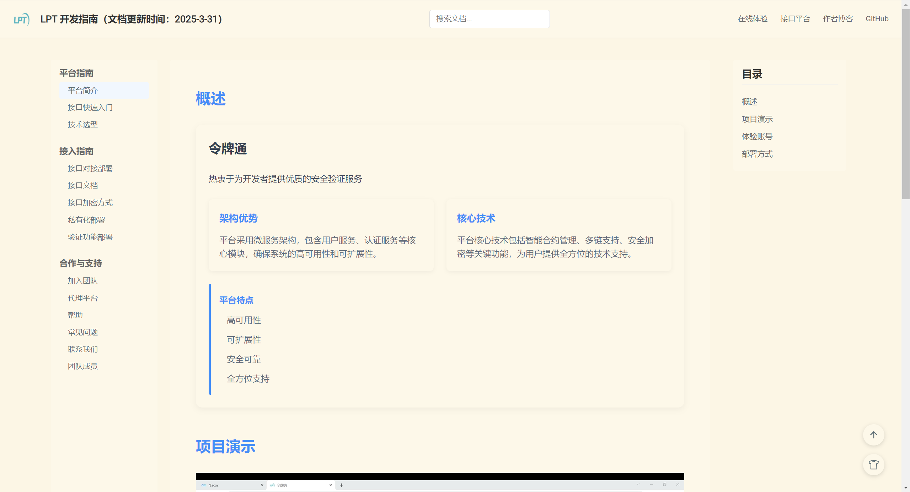


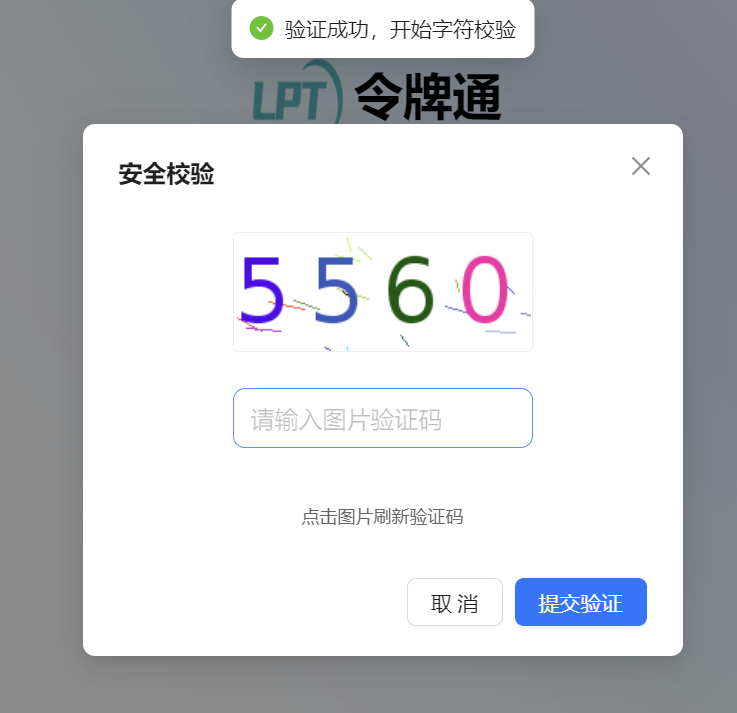

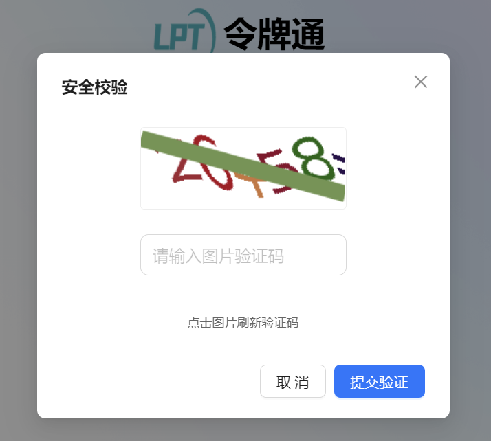

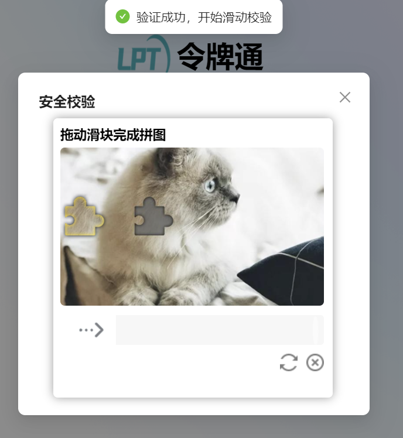

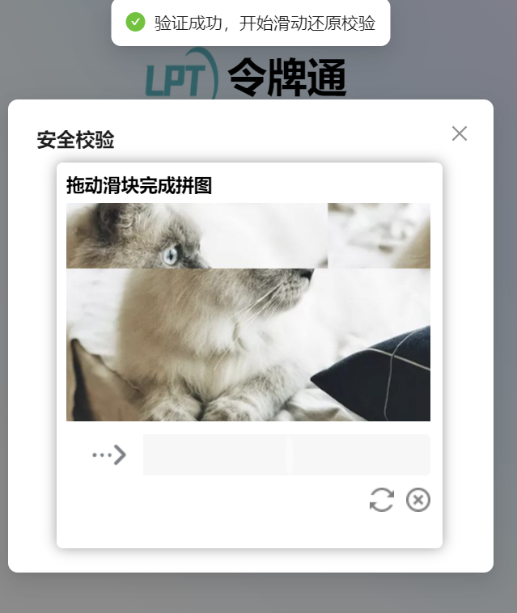

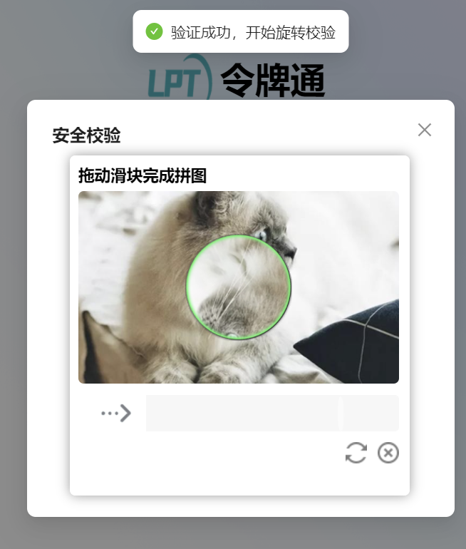

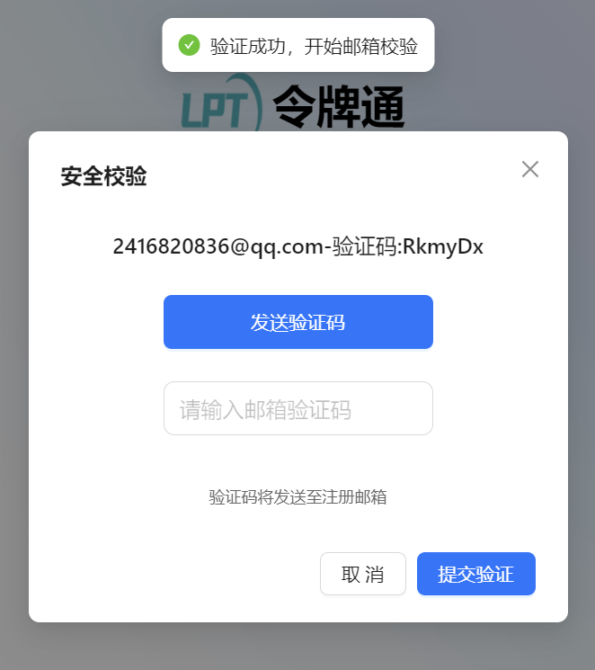

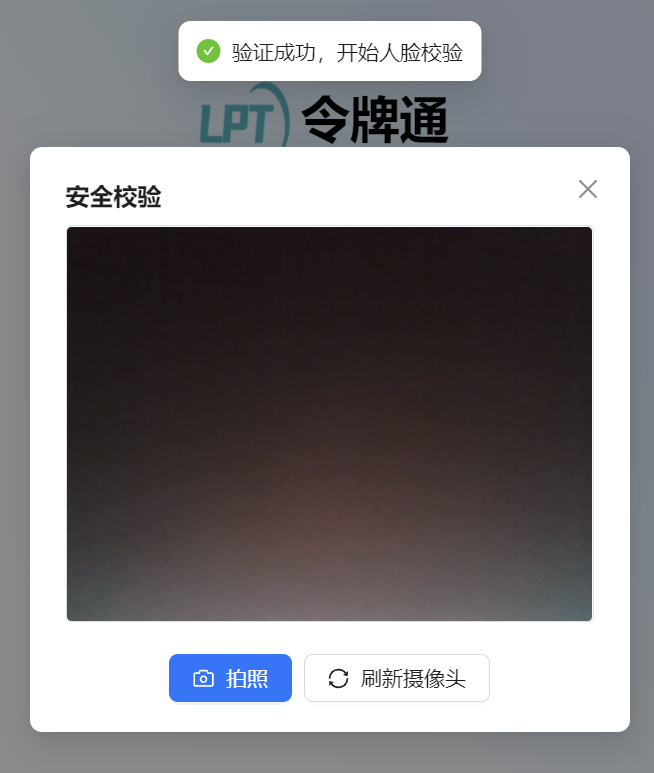

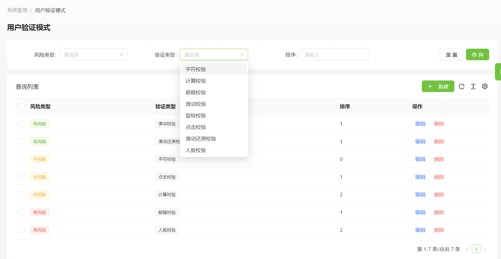

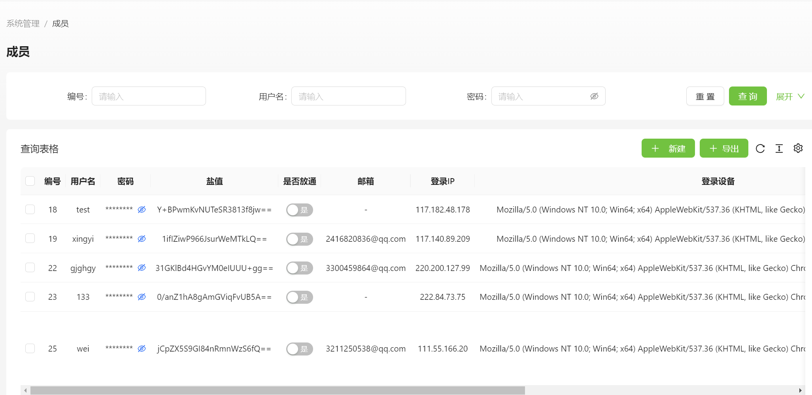

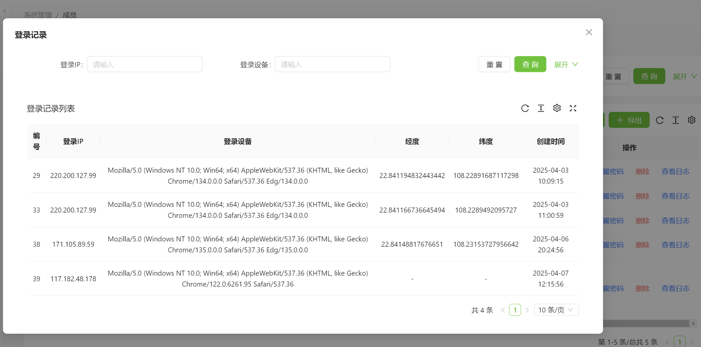

## 🤝 贡献指南

## 📄 开源协议

## 👥 维护者

- [@xingyi](https://gitee.com/xingyiboy)

## 🙏 鸣谢

感谢所有为这个项目做出贡献的开发者！
